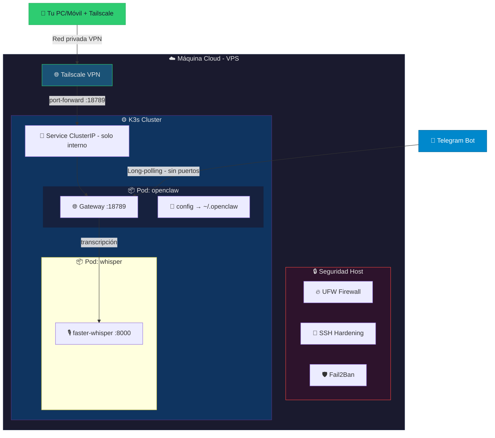

# OpenClaw Server

Server de despliegue para [OpenClaw](https://github.com/nichochar/openclaw) — un agente de IA accesible vía Telegram y dashboard web, desplegado de forma segura en Kubernetes (K3s).

## Arquitectura



## Estructura del proyecto

```
openclaw-server/
├── README.md
├── openclaw-server/
│   ├── Dockerfile              # Imagen base con OpenClaw
│   └── docker-compose.yml      # Alternativa: despliegue con Docker Compose
├── compose/
│   ├── deploy.sh               # Script de despliegue en K3s
│   └── k8s/
│       ├── namespace.yaml      # Namespace: openclaw
│       ├── pv.yaml             # PersistentVolumes
│       ├── deployment.yaml     # Deployment con securityContext
│       ├── service.yaml        # ClusterIP (NO expuesto públicamente)
│       └── whisper.yaml        # Whisper: transcripción de audio
└── security/
    ├── setup-firewall.sh       # Configuración UFW
    ├── harden-ssh.sh           # Hardening SSH
    ├── setup-fail2ban.sh       # Fail2Ban contra fuerza bruta
    ├── setup-tailscale.sh      # VPN para acceso seguro al dashboard
    └── auto-update.sh          # Actualización diaria automática
```

## Requisitos

- **VPS Linux** (Ubuntu/Debian recomendado, mínimo 4GB RAM)
- **Docker** (para construir la imagen)
- **K3s** (Kubernetes ligero)
- **Tailscale** (VPN para acceso seguro al dashboard)

---

## Despliegue Completo (paso a paso)

### 1. Instalar K3s y Docker

```bash
# K3s
curl -sfL https://get.k3s.io | sh -

# Docker
curl -fsSL https://get.docker.com | sh
```

### 2. Clonar el repositorio

```bash
git clone <tu-repo> openclaw-server && cd openclaw-server
```

### 3. Construir e importar la imagen

```bash
docker build -t openclaw:latest ./openclaw-server
docker save openclaw:latest | sudo k3s ctr images import -
```

### 4. Hardening del servidor (CRÍTICO)

> ⚠️ **Ejecuta estos scripts ANTES del despliegue.** OpenClaw tiene acceso al sistema; asegurar el servidor es fundamental.

```bash
# Firewall: solo SSH + Tailscale + K3s
sudo bash security/setup-firewall.sh

# SSH: desactivar contraseñas, solo claves públicas
sudo bash security/harden-ssh.sh

# Fail2Ban: banear IPs tras 3 intentos fallidos
sudo bash security/setup-fail2ban.sh
```

#### Verificar el hardening

```bash
# Firewall activo
sudo ufw status verbose

# SSH configurado
sudo sshd -T | grep -E "passwordauthentication|pubkeyauthentication"

# Fail2Ban activo
sudo fail2ban-client status sshd
```

### 5. Instalar Tailscale (acceso VPN)

```bash
sudo bash security/setup-tailscale.sh
```

Después:
1. Copia el enlace que aparece y ábrelo en tu navegador para vincular el servidor
2. Instala Tailscale en tu PC/móvil desde [tailscale.com/download](https://tailscale.com/download)
3. Ambos dispositivos estarán en la misma red privada

### 6. Desplegar en Kubernetes

```bash
sudo bash compose/deploy.sh
```

### 7. Configurar OpenClaw (primera vez)

```bash
sudo kubectl exec -it deployment/openclaw -n openclaw -- openclaw onboard
```

Esto te guiará para:
- **Aceptar** el aviso de seguridad
- **Seleccionar** "Quickstart"
- **Conectar IA**: elegir proveedor (OpenAI/Google) e iniciar sesión
- **Conectar Telegram**: pegar el API Token de @BotFather
- **Habilitar Skills**: Cloudhood, herramientas de sistema, etc.
- **Configurar Hooks**: seleccionar método de automatización

### 8. Vincular Telegram

1. Abre tu bot en Telegram y envía `/start`
2. El bot **denegará el acceso** y mostrará tu ID + código
3. Autoriza desde el contenedor:

```bash
sudo kubectl exec -it deployment/openclaw -n openclaw -- openclaw pairing approve telegram <CODIGO>
```

### 9. Acceder al Dashboard (vía Tailscale)

El dashboard **NO** está expuesto públicamente. Accede así:

```bash
# Iniciar port-forward a través de Tailscale
sudo kubectl port-forward svc/openclaw 18789:18789 \
  -n openclaw --address=$(tailscale ip -4)
```

Abre en tu navegador: `http://<TU-IP-TAILSCALE>:18789`

#### Primer acceso al dashboard

```bash
# Generar token de acceso
sudo kubectl exec deployment/openclaw -n openclaw -- openclaw auth token

# Si requiere aprobación de dispositivo
sudo kubectl exec deployment/openclaw -n openclaw -- openclaw devices list
sudo kubectl exec deployment/openclaw -n openclaw -- openclaw devices approve <ID>
```

#### Port-forward permanente (recomendado)

En lugar de ejecutar `kubectl port-forward` manualmente cada vez, puedes instalar un servicio systemd que lo mantenga activo automáticamente:

```bash
# Instalar servicio de port-forward permanente
sudo bash compose/k8s/setup-portforward.sh
```

Esto creará un servicio systemd que:
- Inicia automáticamente al arrancar el servidor
- Se reinicia automáticamente si falla
- Mantiene el dashboard accesible en `http://<TAILSCALE-IP>:18789`

```bash
# Ver estado del servicio
sudo systemctl status openclaw-portforward

# Ver logs en tiempo real
sudo journalctl -u openclaw-portforward -f
```

### 10. Auto-actualización diaria

```bash
# Instalar como cron diario
sudo cp security/auto-update.sh /etc/cron.daily/openclaw-update
sudo chmod +x /etc/cron.daily/openclaw-update
```

Esto reconstruirá la imagen con la última versión de OpenClaw cada día a las ~4AM.

---

## Despliegue alternativo con Docker Compose

Si prefieres usar Docker Compose sin Kubernetes:

```bash
cd openclaw-server
docker compose up -d
docker compose logs -f
```

---

## Volúmenes persistentes

| Volumen | Ruta en el host | Ruta en el contenedor | Propósito |
|---------|----------------|----------------------|-----------|
| config | `/opt/openclaw/config` | `/home/node/.openclaw` | Configuración, estado y memoria del agente |

> **Nota:** Los datos persisten gracias a la política `Retain` de los PersistentVolumes.

---

## Comandos útiles

```bash
# Ver estado del pod
sudo kubectl get pods -n openclaw

# Ver logs en tiempo real
sudo kubectl logs -f deployment/openclaw -n openclaw

# Entrar al contenedor
sudo kubectl exec -it deployment/openclaw -n openclaw -- bash

# Reiniciar el despliegue
sudo kubectl rollout restart deployment/openclaw -n openclaw

# Dashboard vía Tailscale
sudo kubectl port-forward svc/openclaw 18789:18789 \
  -n openclaw --address=$(tailscale ip -4)

# Eliminar todo
sudo kubectl delete namespace openclaw
```

## Seguridad — Resumen

| Capa | Medida | Estado |
|------|--------|--------|
| 🔥 Firewall | UFW: deny all, allow SSH+Tailscale | `security/setup-firewall.sh` |
| 🔑 SSH | Solo clave pública, sin contraseña | `security/harden-ssh.sh` |
| 🛡️ Fuerza bruta | Fail2Ban: ban tras 3 intentos | `security/setup-fail2ban.sh` |
| 🌐 VPN | Tailscale: acceso privado al dashboard | `security/setup-tailscale.sh` |
| 🚫 Gateway | ClusterIP: no expuesto públicamente | `compose/k8s/service.yaml` |

| 🔄 Updates | Cron diario de actualización | `security/auto-update.sh` |
| 🐳 Container | runAsNonRoot, no privilege escalation | `compose/k8s/deployment.yaml` |
