# OpenClaw Server


Server de despliegue para [OpenClaw](https://github.com/nichochar/openclaw) — un agente de IA accesible vía Telegram y dashboard web, desplegado de forma segura en Kubernetes (K3s).

## Arquitectura

```mermaid
graph TB
    subgraph VPS["☁️ Máquina Cloud - VPS"]
        subgraph Security["🔒 Seguridad Host"]
            UFW["🔥 UFW Firewall"]
            SSH["🔑 SSH Hardening"]
            F2B["🛡️ Fail2Ban"]
        end

        subgraph K3s["⚙️ K3s Cluster"]
            subgraph Pod["📦 Pod: openclaw"]
                GW["🌐 Gateway :18789"]
                Vol1["📁 config → ~/.openclaw"]
            end
            subgraph WPod["📦 Pod: whisper"]
                WS["🎙️ faster-whisper :8000"]
            end
            SVC["🔗 Service ClusterIP - solo interno"]
        end

        TS["🌐 Tailscale VPN"]
    end

    User["👤 Tu PC/Móvil + Tailscale"]
    Telegram["💬 Telegram Bot"]

    SVC --> GW
    GW -- "transcripción" --> WS
    TS -- "port-forward :18789" --> SVC
    User -- "Red privada VPN" --> TS
    Telegram -- "Long-polling - sin puertos" --> GW

    style VPS fill:#1a1a2e,stroke:#16213e,color:#e5e5e5
    style Security fill:#2d132c,stroke:#ee4540,color:#e5e5e5
    style K3s fill:#0f3460,stroke:#533483,color:#e5e5e5
    style Pod fill:#16213e,stroke:#0f3460,color:#e5e5e5
    style TS fill:#1a5276,stroke:#2ecc71,color:#e5e5e5
    style User fill:#2ecc71,stroke:#27ae60,color:#1a1a2e
    style Telegram fill:#0088cc,stroke:#006699,color:#ffffff
```



## Estructura del proyecto

```
openclaw-server/
├── README.md
├── Makefile                    # Comandos comunes
├── docker/                     # Imagen Docker de OpenClaw
│   ├── Dockerfile
│   └── docker-compose.yml
├── k8s/                        # Manifiestos Kubernetes
│   ├── namespace.yaml
│   ├── pv.yaml
│   ├── deployment.yaml
│   ├── service.yaml
│   └── whisper.yaml
└── scripts/
    ├── deploy/                 # Scripts de deployment
    │   └── deploy-k8s.sh
    ├── security/               # Setup de seguridad del servidor
    │   ├── deploy-all.sh
    │   ├── setup-firewall.sh
    │   ├── setup-ssh.sh
    │   ├── setup-fail2ban.sh
    │   └── setup-tailscale.sh
    ├── services/               # Servicios systemd del host
    │   ├── portforward/
    │   ├── tailscale-serve/
    │   └── auto-update/
    └── remote/                 # Scripts para ejecutar desde tu PC
        ├── deploy-security.sh
        ├── deploy-tailscale-serve.sh
        └── update-portforward.sh
```

## Requisitos

- **VPS Linux** (Ubuntu/Debian recomendado, mínimo 4GB RAM)
- **Docker** (para construir la imagen)
- **K3s** (Kubernetes ligero)
- **Tailscale** (VPN para acceso seguro al dashboard)

---

## Despliegue Completo (paso a paso)

### 1. Instalar K3s y Docker

```bash
# K3s
curl -sfL https://get.k3s.io | sh -

# Docker
curl -fsSL https://get.docker.com | sh
```

### 2. Clonar el repositorio

```bash
git clone <tu-repo> openclaw-server && cd openclaw-server
```

### 3. Construir e importar la imagen

```bash
# Opción A: Manual
docker build -t openclaw:latest ./docker
docker save openclaw:latest | sudo k3s ctr images import -

# Opción B: Con Makefile
make build-image
```

### 4. Hardening del servidor (CRÍTICO)

> ⚠️ **Ejecuta estos scripts ANTES del despliegue.** OpenClaw tiene acceso al sistema; asegurar el servidor es fundamental.

```bash
# Opción A: Todo en uno
make setup-security

# Opción B: Scripts individuales
sudo bash scripts/security/setup-firewall.sh
sudo bash scripts/security/setup-ssh.sh
sudo bash scripts/security/setup-fail2ban.sh
```

#### Verificar el hardening

```bash
# Firewall activo
sudo ufw status verbose

# SSH configurado
sudo sshd -T | grep -E "passwordauthentication|pubkeyauthentication"

# Fail2Ban activo
sudo fail2ban-client status sshd
```

### 5. Instalar Tailscale (acceso VPN)

```bash
sudo bash scripts/security/setup-tailscale.sh
```

Después:
1. Copia el enlace que aparece y ábrelo en tu navegador para vincular el servidor
2. Instala Tailscale en tu PC/móvil desde [tailscale.com/download](https://tailscale.com/download)
3. Ambos dispositivos estarán en la misma red privada

### 6. Desplegar en Kubernetes

```bash
# Opción A: Con Makefile
make deploy

# Opción B: Manual
sudo bash scripts/deploy/deploy-k8s.sh
```

### 7. Configurar OpenClaw (primera vez)

```bash
sudo kubectl exec -it deployment/openclaw -n openclaw -- openclaw onboard
```

Esto te guiará para:
- **Aceptar** el aviso de seguridad
- **Seleccionar** "Quickstart"
- **Conectar IA**: elegir proveedor (OpenAI/Google) e iniciar sesión
- **Conectar Telegram**: pegar el API Token de @BotFather
- **Habilitar Skills**: Cloudhood, herramientas de sistema, etc.
- **Configurar Hooks**: seleccionar método de automatización

### 8. Vincular Telegram

1. Abre tu bot en Telegram y envía `/start`
2. El bot **denegará el acceso** y mostrará tu ID + código
3. Autoriza desde el contenedor:

```bash
sudo kubectl exec -it deployment/openclaw -n openclaw -- openclaw pairing approve telegram <CODIGO>
```

### 9. Acceder al Dashboard (vía Tailscale)

El dashboard **NO** está expuesto públicamente. Accede así:

```bash
# Iniciar port-forward a través de Tailscale
sudo kubectl port-forward svc/openclaw 18789:18789 \
  -n openclaw --address=$(tailscale ip -4)
```

Abre en tu navegador: `http://<TU-IP-TAILSCALE>:18789`

#### Primer acceso al dashboard

```bash
# Generar token de acceso
sudo kubectl exec deployment/openclaw -n openclaw -- openclaw auth token

# Si requiere aprobación de dispositivo
sudo kubectl exec deployment/openclaw -n openclaw -- openclaw devices list
sudo kubectl exec deployment/openclaw -n openclaw -- openclaw devices approve <ID>
```

#### Port-forward permanente (recomendado)

En lugar de ejecutar `kubectl port-forward` manualmente cada vez, puedes instalar un servicio systemd que lo mantenga activo automáticamente:

```bash
# Opción A: Con Makefile
make install-portforward

# Opción B: Manual
sudo bash scripts/services/portforward/install.sh
```

Esto creará un servicio systemd que:
- Inicia automáticamente al arrancar el servidor
- Se reinicia automáticamente si falla
- Mantiene el dashboard accesible en `http://<TAILSCALE-IP>:18789`

```bash
# Ver estado del servicio
sudo systemctl status openclaw-portforward

# Ver logs en tiempo real
sudo journalctl -u openclaw-portforward -f
```

#### Port-forward con HTTPS (Tailscale Serve) — Recomendado

Para evitar el mensaje "control ui requires HTTPS or localhost", usa Tailscale Serve que proporciona HTTPS automático:

```bash
# Opción A: Con Makefile
make install-tailscale-serve

# Opción B: Manual
sudo bash scripts/services/tailscale-serve/install.sh
sudo bash scripts/services/tailscale-serve/install-service.sh
```

Tu dashboard estará disponible en `https://<tu-servidor>.tail<hash>.ts.net` con certificado SSL.

**Ventajas de Tailscale Serve:**
- ✅ HTTPS automático (sin mensajes de error del navegador)
- ✅ Certificados válidos gestionados por Tailscale
- ✅ No requiere configuración de DNS
- ✅ Acceso solo desde tu red Tailscale (privado)

##### Confiar en el certificado SSL

El navegador puede mostrar una advertencia de seguridad la primera vez. Tienes dos opciones:

**Opción 1: Aceptar manualmente (más simple)**

- **Chrome/Edge/Brave**: Click "Avanzado" → "Continuar al sitio (no seguro)"
- **Firefox**: Click "Avanzado" → "Aceptar el riesgo y continuar"

**Opción 2: Importar certificado permanentemente**

<details>
<summary>Linux</summary>

```bash
# Obtener el certificado de Tailscale
ssh usuario@servidor "sudo tailscale cert <tu-servidor>.tail<hash>.ts.net"

# Copiar a tu PC
scp usuario@servidor:~/<tu-servidor>.tail<hash>.ts.net.crt ~/

# Instalar en el sistema
sudo cp ~/<tu-servidor>.tail<hash>.ts.net.crt /usr/local/share/ca-certificates/
sudo update-ca-certificates

# Reiniciar navegador
```
</details>

<details>
<summary>Windows</summary>

```bash
# Descargar certificado desde el servidor
scp usuario@servidor:~/<tu-servidor>.tail<hash>.ts.net.crt C:\Users\TU_USUARIO\Downloads\
```

1. Abre el archivo `.crt` (doble clic)
2. Click "**Instalar certificado...**"
3. Selecciona "**Equipo local**" (Local Machine)
4. Selecciona "**Colocar todos los certificados en el siguiente almacén**"
5. Click "**Examinar**" → "**Entidades de certificación raíz de confianza**"
6. Click "**Siguiente**" → "**Finalizar**"
7. Reinicia el navegador
</details>

<details>
<summary>macOS</summary>

```bash
# Descargar certificado
scp usuario@servidor:~/<tu-servidor>.tail<hash>.ts.net.crt ~/Downloads/

# Importar a Keychain
sudo security add-trusted-cert -d -r trustRoot \
  -k /Library/Keychains/System.keychain \
  ~/Downloads/<tu-servidor>.tail<hash>.ts.net.crt

# Reiniciar navegador
```
</details>

##### Alternativa: Túnel SSH (sin certificados)

Si prefieres no gestionar certificados, usa un túnel SSH para acceder como `localhost`:

```bash
# Desde tu PC
ssh -i ~/.ssh/tu-clave -L 18789:127.0.0.1:18789 usuario@servidor -N
```

Luego accede a `http://localhost:18789` — el navegador no pedirá HTTPS.

**Comandos útiles:**

```bash
# Ver configuración actual de Tailscale Serve
sudo tailscale serve status

# Resetear configuración
sudo tailscale serve reset

# Ver logs del servicio
sudo journalctl -u openclaw-localhost-forward -f
```

### 10. Auto-actualización diaria

```bash
# Opción A: Con Makefile
make install-auto-update

# Opción B: Manual
sudo cp scripts/services/auto-update/install.sh /etc/cron.daily/openclaw-update
sudo chmod +x /etc/cron.daily/openclaw-update
```

Esto reconstruirá la imagen con la última versión de OpenClaw cada día a las ~4AM.

---

## Despliegue alternativo con Docker Compose

Si prefieres usar Docker Compose sin Kubernetes:

```bash
cd openclaw-server
docker compose up -d
docker compose logs -f
```

---

## Volúmenes persistentes

| Volumen | Ruta en el host | Ruta en el contenedor | Propósito |
|---------|----------------|----------------------|-----------|
| config | `/opt/openclaw/config` | `/home/node/.openclaw` | Configuración, estado y memoria del agente |

> **Nota:** Los datos persisten gracias a la política `Retain` de los PersistentVolumes.

---

## Comandos útiles

```bash
# Ver estado del pod
sudo kubectl get pods -n openclaw

# Ver logs en tiempo real
sudo kubectl logs -f deployment/openclaw -n openclaw

# Entrar al contenedor
sudo kubectl exec -it deployment/openclaw -n openclaw -- bash

# Reiniciar el despliegue
sudo kubectl rollout restart deployment/openclaw -n openclaw

# Dashboard vía Tailscale
sudo kubectl port-forward svc/openclaw 18789:18789 \
  -n openclaw --address=$(tailscale ip -4)

# Eliminar todo
sudo kubectl delete namespace openclaw
```

## Seguridad — Resumen

| Capa | Medida | Estado |
|------|--------|--------|
| 🔥 Firewall | UFW: deny all, allow SSH+Tailscale | `security/setup-firewall.sh` |
| 🔑 SSH | Solo clave pública, sin contraseña | `security/harden-ssh.sh` |
| 🛡️ Fuerza bruta | Fail2Ban: ban tras 3 intentos | `security/setup-fail2ban.sh` |
| 🌐 VPN | Tailscale: acceso privado al dashboard | `security/setup-tailscale.sh` |
| 🚫 Gateway | ClusterIP: no expuesto públicamente | `compose/k8s/service.yaml` |

| 🔄 Updates | Cron diario de actualización | `security/auto-update.sh` |
| 🐳 Container | runAsNonRoot, no privilege escalation | `compose/k8s/deployment.yaml` |
